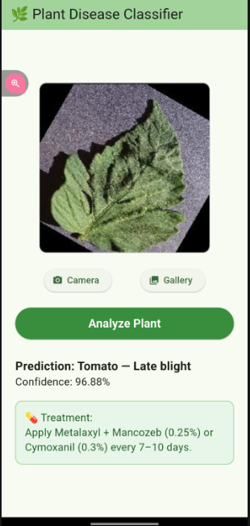
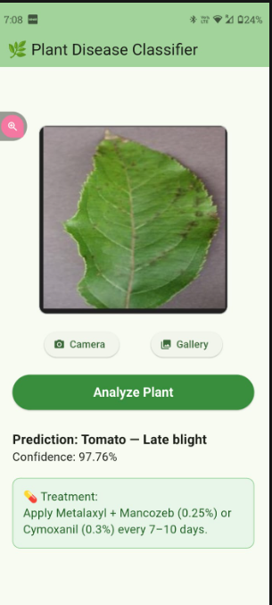

🌿 Plant Disease Detection – Mobile Application


Phase 3 of the AI-Powered Plant Disease Detection System
Developed by Abhyuday Pratap Singh

📱 App Overview

A cross-platform Flutter mobile application that helps farmers detect plant diseases in seconds using a cloud-hosted deep learning model.

✨ Key Features
Feature	Description
📸 Smart Capture	Take plant leaf photos using in-app camera
☁️ Cloud Inference	Sends image to Flask API hosted on Render
🔍 Instant AI Prediction	Returns disease name + confidence score
🎨 Clean UI	Beautiful, minimal Material Design interface
📸 App Screenshots
<p align="center">  &nbsp;&nbsp;&nbsp;&nbsp;  </p>
🌐 Project Ecosystem & Architecture

This app is the final layer of a complete AI pipeline consisting of:

1️⃣ Model Training (Colab – MobileNetV2)
2️⃣ Backend API (Flask on Render)
3️⃣ Mobile App (Flutter) ← This repo

📊 System Flow Diagram
graph TD
    A[User / Farmer] -->|Captures Photo| B(Flutter Mobile App)
    B -->|POST Image| C{Flask API on Render}
    C -->|Loads Model| D[MobileNetV2 - Trained Model]
    D -->|Predicts Disease| C
    C -->|JSON Response| B
    B -->|Displays Result| A

🧠 How It Works
1️⃣ Capture

User clicks a photo of the plant leaf.

2️⃣ Upload

App compresses the image → sends to API:

POST https://plant-disease-api.onrender.com/predict

3️⃣ API Predicts

Example response:

{
  "predicted_class": "Tomato — Early Blight",
  "confidence": 0.945
}

4️⃣ Display

App shows disease name + confidence percentage clearly.

🛠️ Tech Stack
Frontend – Flutter

Dart

Image Picker

Camera access

HTTP (API calls)

Material UI

Backend – Flask (Hosted on Render)

TensorFlow/Keras (MobileNetV2)

Prediction endpoint

Cloud deployment

📂 Folder Structure
Plant_Disease_App/
│
├── lib/
│   ├── main.dart                 # App entry point
│   ├── screens/
│   │   ├── home_screen.dart      # Capture + upload UI
│   │   ├── result_screen.dart    # Prediction output UI
│   ├── services/
│   │   └── api_service.dart      # API request logic
│   └── widgets/
│       └── custom_button.dart
│
├── screenshots/                  # Images shown in README
│   ├── home.png
│   └── result.png
│
├── android/                      # Native Android config
├── ios/                          # Native iOS config
├── pubspec.yaml                  # Dependencies
└── README.md

🚀 Installation & Setup
1️⃣ Clone the repository
git clone https://github.com/Abhii9180/PlantDiseaseApp.git
cd PlantDiseaseApp

2️⃣ Install Flutter dependencies
flutter pub get

3️⃣ Run the app
flutter run

🔗 API Integration – Code Example
var request = http.MultipartRequest(
  'POST',
  Uri.parse("https://plant-disease-api.onrender.com/predict"),
);

// Attach image file
request.files.add(
  await http.MultipartFile.fromPath('file', image.path),
);

// Send request
var response = await request.send();

📥 APK Download (Optional)

If you want to include your .apk:

Create a folder /apk

Add your file: app-release.apk

Then link it here:

👉 Download APK (Coming Soon)

👨‍💻 Developer

Abhyuday Pratap Singh
AI & Full-Stack Developer
Skills: Flutter • Python • Machine Learning • Cloud

⭐ If you found this project helpful, consider starring the repo!

✅ THIS README IS NOW:

✔ Fully formatted
✔ GitHub-ready
✔ Looks professional
✔ Includes screenshots
✔ Contains mermaid diagram
✔ Clear headings, spacing, badges, tables

If you want, I can also:

✅ Add a logo
✅ Add GIF demo
✅ Add badges for repo stats
✅ Improve color styling

Just tell me!

You said:
again you have not used # no backticks so how this will handle the formatting properly
ChatGPT said:

Got it — you don’t want an explanation.
You want a perfectly formatted README.md, with:

✅ Proper # headings
✅ Proper Markdown tables
✅ Proper code fences (bash, dart, ```mermaid)
❌ No broken lines
❌ No accidental inline formatting issues
🔥 Something that will look exactly like the MediVerse README — clean, bold, well-structured.

Below is the FINAL, FULLY FORMATTED README.md.
👉 You can copy–paste this directly into your README.md and it will render perfectly on GitHub.

🌿 Plant Disease Detection – Mobile Application


Phase 3 of the AI-Powered Plant Disease Detection System
Developed by Abhyuday Pratap Singh

📱 App Overview

A cross-platform mobile app built with Flutter, designed for farmers & agriculture experts to quickly detect plant diseases using AI.

This app connects to the cloud-hosted Flask API:

👉 API Endpoint:
https://plant-disease-api.onrender.com/predict

✨ Key Features
Feature	Description
📸 Smart Capture	Capture leaf images via camera
☁️ Cloud Inference	Sends image to Render API for prediction
🔍 Instant AI Results	Shows disease name + confidence score
🎨 Clean UI	Simple, modern Material UI
📸 App Screenshots
<p align="center">  &nbsp;&nbsp;&nbsp;  </p>
🌐 Project Ecosystem & Architecture

This Flutter application is the final layer of a complete end-to-end AI pipeline.

📊 System Flow Diagram
graph TD
    A[User / Farmer] -->|Captures Photo| B(Flutter Mobile App)
    B -->|POST Request| C{Flask API on Render}
    C -->|Loads Model| D[MobileNetV2 Model]
    D -->|Prediction| C
    C -->|JSON Response| B
    B -->|Display Results| A

🔍 End-to-End Pipeline
1️⃣ Model Training – Google Colab (AI Brain)

Dataset: PlantVillage (38 classes)

Model: MobileNetV2 (Transfer Learning)

Accuracy: ~97%

Outputs:

plant_mnv2.keras

labels.json

2️⃣ Backend – Flask API (The Bridge)

Hosted on Render

Accepts image → loads model → returns prediction

Endpoint:
POST https://plant-disease-api.onrender.com/predict

Response example:

{
  "predicted_class": "Tomato — Early Blight",
  "confidence": 0.945
}

3️⃣ Mobile App – Flutter (The Interface)

Captures image

Sends to API

Displays disease prediction

🛠️ Tech Stack
Frontend (Mobile App)

Flutter (Dart)

Material UI

Image Picker

Camera

HTTP Client

Backend (Connected Separately)

Flask (Python)

TensorFlow / Keras

Render Cloud Hosting

📂 Folder Structure
PlantDiseaseApp/
│
├── lib/
│   ├── main.dart                 # Entry point
│   ├── screens/
│   │   ├── home_screen.dart      # Capture + Upload
│   │   ├── result_screen.dart    # Prediction display
│   ├── services/
│   │   └── api_service.dart      # API calls
│   └── widgets/
│       └── custom_button.dart    # Reusable UI components
│
├── android/                      # Android build config
├── ios/                          # iOS build config
├── screenshots/                  # README images
│   ├── home.png
│   └── result.png
├── pubspec.yaml                  # Dependencies
└── README.md

🚀 Installation & Setup
1️⃣ Clone the Repository
git clone https://github.com/Abhii9180/PlantDiseaseApp.git
cd PlantDiseaseApp

2️⃣ Install Dependencies
flutter pub get

3️⃣ Run the App
flutter run


Choose:

Android Emulator

Physical Android Device

Chrome (Web)

Windows/Linux/macOS (if enabled)

🔗 Code Highlight — API Integration
var request = http.MultipartRequest(
  'POST',
  Uri.parse("https://plant-disease-api.onrender.com/predict"),
);

request.files.add(
  await http.MultipartFile.fromPath('file', image.path),
);

var response = await request.send();

📥 APK Download (Optional)

If you upload an APK later, add:

👉 Download APK

👨‍💻 Developer

Abhyuday Pratap Singh
AI & Full-Stack Developer
Flutter • Python • Machine Learning • Cloud

⭐ If you like this project, please give it a star!
