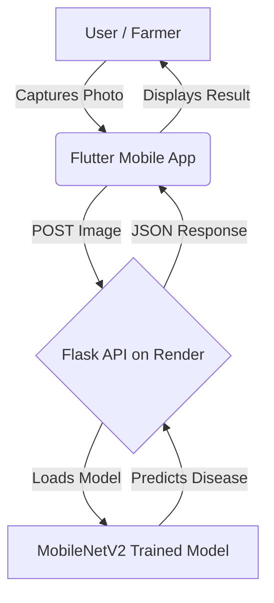

# 🌿 Plant Disease Detection – Mobile Application


> **Phase 3 of the AI-Powered Plant Disease Detection System**
> *Developed by **Abhyuday Pratap Singh***

---

## 📱 App Overview

A cross-platform **Flutter mobile application** designed for farmers and agricultural experts to detect plant diseases instantly using a cloud-hosted deep learning model.

This app communicates with a deployed Flask API:

👉 **API Endpoint:** [https://plant-disease-api.onrender.com/predict](https://plant-disease-api.onrender.com/predict)

---

## ✨ Key Features

| Feature                   | Description                                      |
| ------------------------- | ------------------------------------------------ |
| 📸 **Smart Capture**      | Take plant leaf images using the built-in camera |
| ☁️ **Cloud Inference**    | Sends image to Flask API hosted on Render        |
| 🔍 **Instant Prediction** | AI model returns disease name + confidence score |
| 🎨 **Modern UI**          | Clean, minimal, production-ready Material UI     |

---

## 📸 App Screenshots

<p align="center">
  
  &nbsp;&nbsp;&nbsp;
  
</p>

---

## 🌐 Project Ecosystem & Architecture

This mobile app is the **third and final phase** of the complete AI-powered plant disease detection pipeline:

1️⃣ **Model Training** – Google Colab (MobileNetV2, 97% accuracy)
2️⃣ **Backend API** – Flask + TensorFlow deployed on Render
3️⃣ **Mobile App** – Flutter (this repository)

---

## 📊 System Flow Diagram



---

## 🧠 How It Works

### 1️⃣ Capture

User captures a plant leaf image with the camera.

### 2️⃣ Upload

App compresses and uploads the image to the API:

```
POST https://plant-disease-api.onrender.com/predict
```

### 3️⃣ Prediction (Backend Response)

```json
{
  "predicted_class": "Tomato — Early Blight",
  "confidence": 0.945
}
```

### 4️⃣ Display

The predicted disease and confidence score are shown beautifully in-app.

---

## 🛠️ Tech Stack

### **Frontend – Flutter**

* Dart
* Image Picker
* Camera access
* HTTP Client
* Material UI components

### **Backend – Flask (connected separately)**

* TensorFlow / Keras
* MobileNetV2 model
* Render Cloud Hosting

---

## 📂 Folder Structure

```
PlantDiseaseApp/
│
├── lib/
│   ├── main.dart                # Entry point
│   ├── screens/
│   │   ├── home_screen.dart     # Capture & Upload UI
│   │   └── result_screen.dart   # Prediction result screen
│   ├── services/
│   │   └── api_service.dart     # API communication
│   └── widgets/
│       └── custom_button.dart   # Reusable UI components
│
├── screenshots/                 # Images used in README
│   ├── home.png
│   └── result.png
│
├── android/                     # Android-specific files
├── ios/                         # iOS-specific files
├── pubspec.yaml                 # Dependencies
└── README.md
```

---

## 🚀 Installation & Setup

### 1️⃣ Clone the Repository

```bash
git clone https://github.com/Abhii9180/PlantDiseaseApp.git
cd PlantDiseaseApp
```

### 2️⃣ Install Dependencies

```bash
flutter pub get
```

### 3️⃣ Run the App

```bash
flutter run
```

Choose a device:

* Android Emulator
* Physical smartphone
* Chrome (Web mode)
* Desktop (if enabled)

---

## 🔗 API Integration (Sample Code)

```dart
var request = http.MultipartRequest(
  'POST',
  Uri.parse("https://plant-disease-api.onrender.com/predict"),
);

request.files.add(
  await http.MultipartFile.fromPath('file', image.path),
);

var response = await request.send();
```

---


---

## 👨‍💻 Developer

**Abhyuday Pratap Singh**
AI & Full‑Stack Developer
Flutter • Python • Machine Learning • Cloud

⭐ *If you like this project, please consider starring the repository!*
